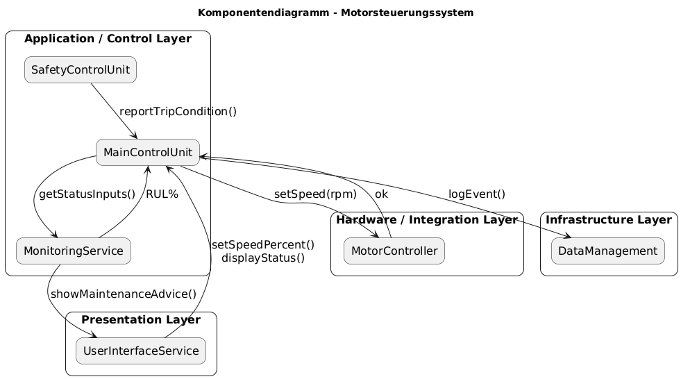

# Architektur

## Architekturmuster festlegen

**Schichten- und komponentenbasierte Architektur**:

- **Klare Trennung der Verantwortlichkeiten**:
  - hardwarenahe Steuerung des Schneidemotors
  - Steuerungs- und Zustandslogik (MainControlUnit)
  - Benutzeroberfläche (Bedienung und Statusanzeige)
  - Safety / Not-Halt-Signalverarbeitung
  - Datenerfassung und Protokollierung
- **Top-down-Kommunikation:** Eingaben erfolgen über das UI → Logik → Hardware; Rückmeldungen (z. B. Safety, Monitoring) werden nach oben propagiert.
- **Erweiterbarkeit:** Wartungslogik, Monitoring und Logging können als separate Module ergänzt werden, ohne bestehende Steuerlogik zu verändern.
- **Testbarkeit:** Jede Komponente kann isoliert getestet werden (Mock-Interfaces für Hardware und UI).
- **Kein Querzugriff:** UI kommuniziert ausschließlich mit der `MainControlUnit`; Hardware-Komponenten (z. B. Motor, Sensor) sind abstrahiert.

_Ebenenübersicht_:

1. **Presentation Layer**: `UserInterfaceService`
2. **Application / Control Layer**: `MainControlUnit`, `SetpointManager`, `MaintenanceManager`
3. **Hardware Layer**: `MotorActuator`, `CurrentSensor`, `SafetyInput`
4. **Persistence / Infrastructure Layer**: `CsvLogger`, `FileDriver`

---

## Komponentendiagramm

## Zuordnung der Requirements zu den Architektur-Schichten

| Architektur-Schicht      | Zugehörige Requirements | Beschreibung |
|--------------------------|--------------------------|--------------|
| **User Interface**       | F1, NF2, NF6             | Eingabe der Drehzahl, schnelle Reaktionszeit, Genauigkeit der Anzeige/Sollwertvorgabe |
| **Control-Logic**        | F1, F2, NF2, NF3, NF5     | Sollwertaufbereitung, Not-Halt-Reaktion, Zustandsverwaltung RUN/STOP/FAULT, deterministische Zykluszeiten |
| **Hardware Abstraction** | F2, F3, NF2, NF7          | Not-Halt, Stromaufnahme erfassen, Hardware-Reaktionszeit, Temperaturbereich |
| **Persistence Manager**  | F3, F4, F5, NF4, NF5      | Logging 1 Hz, Wartungszähler, CSV-Dateiverwaltung, maximale Dateigröße |

---

## Beschreibung der Komponenten

| Komponente         | Rolle                         | Verantwortlichkeiten |
|--------------------|-------------------------------|-----------------------|
| **UserInterface**  | Präsentationsschicht          | Eingabe der Schneidegeschwindigkeit (10 %-Schritte); Anzeige von Soll-/Istwert; Anzeige von Statusmeldungen (RUN/STOP/FAULT); Rückmeldung an die Steuerungslogik |
| **Steuerungslogik** | Anwendungslogik              | Verarbeitung der Bedienbefehle; Verwaltung der Betriebszustände (RUN, STOP, FAULT); Sollwertaufbereitung; Reaktion auf Not-Halt; zyklische Steuerung des Gesamtsystems |
| **HardwareAbstraction** | Hardware-Interface       | Ansteuerung des Schneidemotors (PWM/Duty-Cycle); Erfassung der Stromaufnahme; Weiterleitung des Safety-Signals; Vereinheitlichung aller hardware-nahen Funktionen |
| **PersistenceManager** | Speicher-/Diagnose-Schicht | Protokollierung der Prozessdaten (Sollwert, Istwert, Stromaufnahme, Systemzustand); CSV-Dateiverwaltung (1 Hz); Verwaltung des Wartungszählers; Bereitstellung von Diagnose- und Log-Daten |

---

## Verantwortlichkeiten der Komponenten

| **Komponente**          | **Rolle**                 | **Verantwortlichkeiten**                                                                 |
|-------------------------|---------------------------|-------------------------------------------------------------------------------------------|
| **UserInterfaceService**| Präsentationsschicht      | Eingabe (Start/Stop/Sollwert), Anzeige von Status, Drehzahl, Warn- und Wartungshinweisen |
| **MainControlUnit**     | zentrale Steuerlogik      | Steuerung aller Teilfunktionen, Zustandsverwaltung RUN/STOP/FAULT, Logging-Trigger       |
| **MotorActuator**       | Hardware-Schicht          | PWM-Ausgabe, Geschwindigkeit setzen, sofortiger Stop bei Safety-Signal                   |
| **SafetyInput**         | Safety-Schicht            | Not-Halt-Signal detektieren, Statusmeldung an Logik weiterleiten                         |
| **CurrentSensor**       | Sensorik / Monitoring     | Stromaufnahme messen (500 ms), Mittelwert über 5 Messpunkte                              |
| **MaintenanceManager**  | Wartungslogik             | Betriebszeit erfassen, Wartungshinweis nach 48 h kumulierter Laufzeit                   |
| **CsvLogger / FileDriver** | Persistenz / Logging   | Ereignisse und Prozessdaten protokollieren, CSV-Datei rotieren bei 1 MB                 |

---

## Schnittstellendefinition

| **Quelle**             | **Ziel**                | **Schnittstelle / Aufruf**                                               | **Zweck**                                      |
|------------------------|-------------------------|---------------------------------------------------------------------------|-----------------------------------------------|
| `UserInterfaceService` | `MainControlUnit`       | `setSpeedPercent(step10)`                                                 | Übermittlung neuer Sollwertvorgabe (10 %-Stufe) |
| `MainControlUnit`      | `MotorActuator`         | `setSpeed(rpmTarget)` / `stopEmergency()`                                 | Weitergabe Sollwert bzw. sofortiger Stop       |
| `MotorActuator`        | `MainControlUnit`       | `confirmSpeedSet()` / `stopped()`                                         | Rückmeldung Motorzustand                      |
| `MainControlUnit`      | `SafetyInput`           | `readSafetyStatus()`                                                      | Abfrage Not-Halt-Status                       |
| `SafetyInput`          | `MainControlUnit`       | `reportTripCondition(status = TRIPPED)`                                   | Signalisiert Not-Halt an Logik                |
| `MainControlUnit`      | `CurrentSensor`         | `readCurrent()`                                                           | Anforderung Messwert                          |
| `CurrentSensor`        | `MainControlUnit`       | `returnSample(meanCurrent)`                                               | Rückgabe Mittelwert                           |
| `MainControlUnit`      | `MaintenanceManager`    | `updateRuntime(deltaTime)`                                                | Übermittlung der Betriebszeit                 |
| `MaintenanceManager`   | `MainControlUnit`       | `maintenanceDue()`                                                        | Signal für fällige Wartung                    |
| `MainControlUnit`      | `CsvLogger`             | `logEvent(eventType, payload)`                                            | Ereignis-Logging                              |
| `CsvLogger`            | `FileDriver`            | `writeCSV(fileName, data)`                                                | Speichern von Logdaten                        |
| `MainControlUnit`      | `UserInterfaceService`  | `updateDisplay(status)` / `showPopup(msg)`                                | Rückmeldung aktueller Systemzustand           |

---

## Technologiestack

| Kategorie                | Technologie / Tool                            | Begründung                                                                                         |
|--------------------------|-----------------------------------------------|----------------------------------------------------------------------------------------------------|
| **Programmiersprache**   | C++ (STM32 / ARM Cortex-M)                    | Objektorientierte Struktur, direkte Hardwarezugriffe, gute Testbarkeit                             |
| **Buildsystem**          | CMake / STM32CubeIDE                          | Standardtoolchain für Embedded-Systeme                                                             |
| **Versionskontrolle**    | Git + GitHub / GitLab                         | Nachvollziehbare Änderungen, Team-Review-fähig                                                     |
| **Modellierung**         | PlantUML + draw.io                            | Nutzung für Klassendiagramme, Sequenz- und Komponentendarstellungen                                |
| **IDE**                  | STM32CubeIDE / VS Code mit C++-Plugin         | Unterstützung für Embedded-Builds und serielle Debugausgabe                                        |
| **Dokumentation**        | Markdown (.md)                                | Versionssicher, für Git-Repos optimiert                                                            |
| **Testframework**        | Unity / CppUTest                              | Leichtgewichtiges Framework für Unittests in Embedded-Umgebung                                    |
| **Codeanalyse**          | cppcheck / SonarLint                          | Analyse von Speicherzugriff, Laufzeitfehlern, Komplexität                                         |
| **Target / Deployment**  | STM32-Board (Simulation optional via Serial)  | Reale Ausführung und Test der Steuerlogik                                                          |

**Hinweis zu Abhängigkeiten:**

- `UserInterfaceService` kommuniziert nur mit der `MainControlUnit`.
- `MainControlUnit` koordiniert alle anderen Komponenten (Motor, Safety, Sensorik, Logging).
- Hardware-Module (`MotorActuator`, `CurrentSensor`, `SafetyInput`) sind vollständig gekapselt.  
- Logging erfolgt zentral über `CsvLogger`, der über `FileDriver` schreibt.
