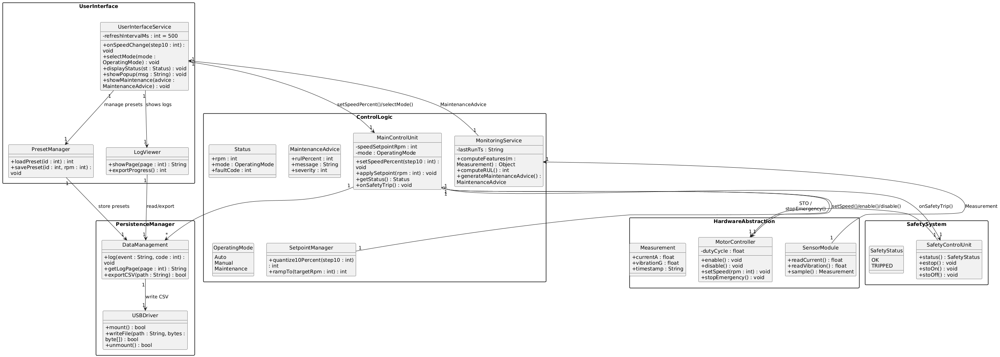
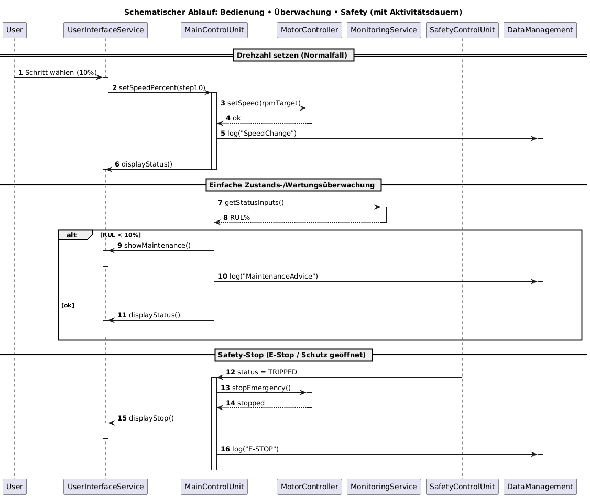
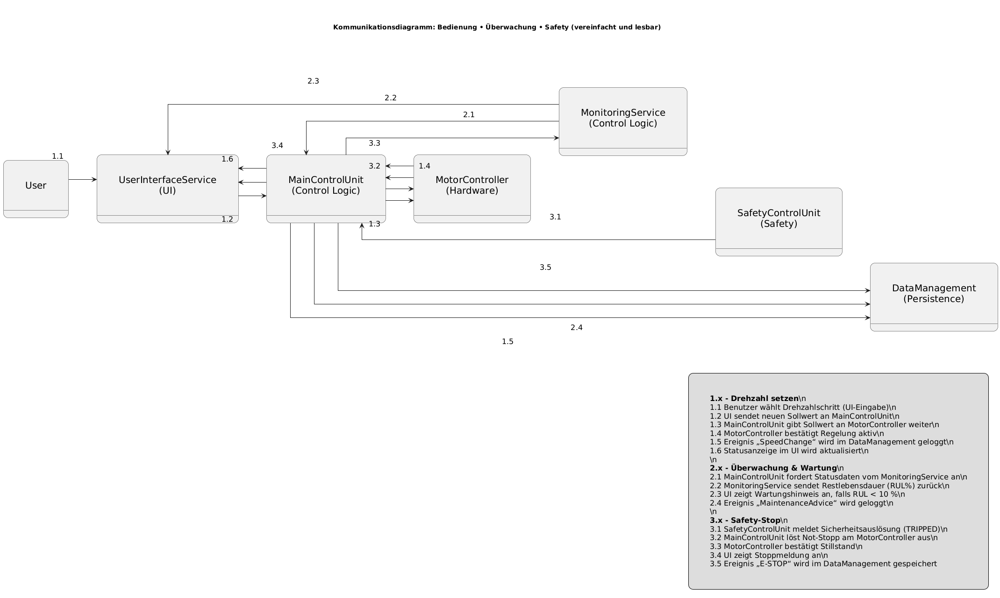

# Design

## Design-Zerlegung (funktional, ohne OO)

### MC – Motor-Controller

#### **C01 Motorregelkreis**
- **Aufgabe:** Sollwertaufbereitung, PI/PID-Regelung, Sanftanlauf, Rampen  
- **Inputs:** `speed_setpoint`, `enable`, `Safety-Freigabe`  
- **Outputs:** `duty_cycle`, `status_motor`  
- **Timing:** zyklisch 1–5 ms (abhängig von PWM/Hardware)  
- **Trace:** F1, F2, F9; NF3  

#### **C02 PWM/Leistungsansteuerung**
- **Aufgabe:** PWM-Generierung, Dead-Time, Überstrom-Schutz (HW-Hooks)  
- **Inputs:** `duty_cycle`  
- **Outputs:** Gate-Signale / Treiber  
- **Timing:** ISR-getrieben  
- **Trace:** F1  

#### **C03 Setpoint-/Ramp-Manager**
- **Aufgabe:** 10-%-Schrittabbildung, Begrenzung, Rampen bei Änderungen  
- **Inputs:** `ui_speed_cmd`  
- **Outputs:** `speed_setpoint`  
- **Timing:** 10 ms  
- **Trace:** F1, F2; NF2  

#### **C04 Motor-Status & Fehlermanager**
- **Aufgabe:** Fehlererkennung (Unter-/Überspannung, Überstrom, Timeout), Zustandsautomat  
- **Inputs:** Diagnoseflags, Safety-Status  
- **Outputs:** Fehlercodes, `status_motor`  
- **Timing:** 10 ms  
- **Trace:** F7, F9  

#### **C05 Safety-Interface (MC-Seite)**
- **Aufgabe:** STO-Eingang überwachen, Freigabe-/Sperrlogik, <0,5 s Stop  
- **Inputs:** `safety_ok`, `estop`  

## Klassendiagramm
Das **Klassendiagramm** beschreibt die **statische Struktur** des Softwaresystems.  
Es zeigt die **Systemkomponenten (Klassen)**, deren **Attribute und Methoden**, sowie die **Beziehungen** zwischen ihnen.  

Für das Schneidesystem sind die zentralen Klassen in funktionale Gruppen gegliedert:
- **UserInterface** – Bedienung, Anzeige und Benutzereingaben  
- **ControlLogic** – Hauptsteuerung, Setpoint-Management, Überwachung  
- **HardwareAbstraction** – Ansteuerung realer Geräte (Motor, Sensoren)  
- **SafetySystem** – Sicherheitsfunktionen (Not-Halt, STO)  
- **PersistenceManager** – Datenverwaltung und Logging  

Dieses Diagramm bildet die **Grundlage für das Software-Design**, da es klar definiert,  
welche Komponenten existieren und wie sie miteinander interagieren.

## Sequenzdiagramm
Das **Sequenzdiagramm** stellt den **zeitlichen Ablauf einer Interaktion** zwischen Objekten dar.  
Es zeigt **welche Komponenten in welcher Reihenfolge kommunizieren**, um eine bestimmte Funktion zu erfüllen.  

Im Beispiel werden die folgenden Abläufe dargestellt:
- **Drehzahländerung** über das User Interface (F1, F2, F6)  
- **Wartungsempfehlung** bei kritischer Restlebensdauer (F3–F5)  
- **Safety-Stop** durch Sicherheitsauslösung (F9, NF1, NF3)

Dadurch lassen sich Kommunikationsflüsse, zeitliche Abhängigkeiten und Systemreaktionen nachvollziehen.  
Das Sequenzdiagramm dient der **Verhaltensbeschreibung und Testvorbereitung**,  
indem es zeigt, wann welche Komponente aktiv ist und wie Nachrichten zeitlich aufeinander folgen.

## Kommunikationsdiagramm
Das **Kommunikationsdiagramm** zeigt die **gleichen Interaktionen wie das Sequenzdiagramm**,  
jedoch in einer **strukturellen, knotenbasierten Darstellung**.  

Es verdeutlicht:
- **Welche Komponenten direkt miteinander kommunizieren**  
- **Welche Nachrichten und Datenflüsse** zwischen diesen bestehen  
- **Wie die Nachrichten zeitlich nummeriert** (1.x, 2.x, 3.x) ablaufen  

Das Diagramm eignet sich besonders gut, um **Kommunikationspfade und Abhängigkeiten**  
zwischen Systemteilen übersichtlich darzustellen, ohne den Fokus auf den zeitlichen Ablauf zu legen.

