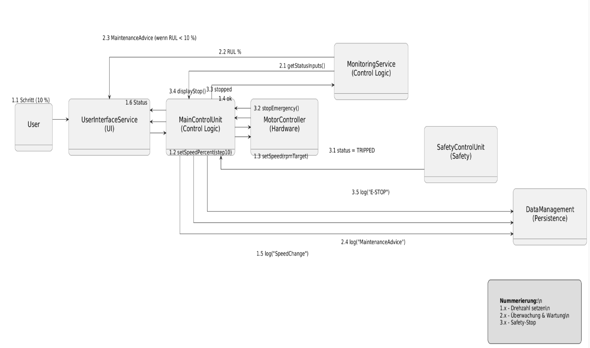

# Design

## Design-Zerlegung (funktional, ohne OO)

### MC – Motor-Controller

#### **C01 Motorregelkreis**
- **Aufgabe:** Sollwertaufbereitung, PI/PID-Regelung, Sanftanlauf, Rampen  
- **Inputs:** `speed_setpoint`, `enable`, `Safety-Freigabe`  
- **Outputs:** `duty_cycle`, `status_motor`  
- **Timing:** zyklisch 1–5 ms (abhängig von PWM/Hardware)  
- **Trace:** F1, F2, F9; NF3  

#### **C02 PWM/Leistungsansteuerung**
- **Aufgabe:** PWM-Generierung, Dead-Time, Überstrom-Schutz (HW-Hooks)  
- **Inputs:** `duty_cycle`  
- **Outputs:** Gate-Signale / Treiber  
- **Timing:** ISR-getrieben  
- **Trace:** F1  

#### **C03 Setpoint-/Ramp-Manager**
- **Aufgabe:** 10-%-Schrittabbildung, Begrenzung, Rampen bei Änderungen  
- **Inputs:** `ui_speed_cmd`  
- **Outputs:** `speed_setpoint`  
- **Timing:** 10 ms  
- **Trace:** F1, F2; NF2  

#### **C04 Motor-Status & Fehlermanager**
- **Aufgabe:** Fehlererkennung (Unter-/Überspannung, Überstrom, Timeout), Zustandsautomat  
- **Inputs:** Diagnoseflags, Safety-Status  
- **Outputs:** Fehlercodes, `status_motor`  
- **Timing:** 10 ms  
- **Trace:** F7, F9  

#### **C05 Safety-Interface (MC-Seite)**
- **Aufgabe:** STO-Eingang überwachen, Freigabe-/Sperrlogik, <0,5 s Stop  
- **Inputs:** `safety_ok`, `estop`  

## Klassendiagramm
Das **Klassendiagramm** beschreibt die **statische Struktur** des Softwaresystems.  
Es zeigt die **Systemkomponenten (Klassen)**, deren **Attribute und Methoden**, sowie die **Beziehungen** zwischen ihnen.  

Für das Schneidesystem sind die zentralen Klassen in funktionale Gruppen gegliedert:
- **UserInterface** – Bedienung, Anzeige und Benutzereingaben  
- **ControlLogic** – Hauptsteuerung, Setpoint-Management, Überwachung  
- **HardwareAbstraction** – Ansteuerung realer Geräte (Motor, Sensoren)  
- **SafetySystem** – Sicherheitsfunktionen (Not-Halt, STO)  
- **PersistenceManager** – Datenverwaltung und Logging  

Dieses Diagramm bildet die **Grundlage für das Software-Design**, da es klar definiert,  
welche Komponenten existieren und wie sie miteinander interagieren.

## Sequenzdiagramm
Das **Sequenzdiagramm** stellt den **zeitlichen Ablauf einer Interaktion** zwischen Objekten dar.  
Es zeigt **welche Komponenten in welcher Reihenfolge kommunizieren**, um eine bestimmte Funktion zu erfüllen.  

Im Beispiel werden die folgenden Abläufe dargestellt:
- **Drehzahländerung** über das User Interface (F1, F2, F6)  
- **Wartungsempfehlung** bei kritischer Restlebensdauer (F3–F5)  
- **Safety-Stop** durch Sicherheitsauslösung (F9, NF1, NF3)

Dadurch lassen sich Kommunikationsflüsse, zeitliche Abhängigkeiten und Systemreaktionen nachvollziehen.  
Das Sequenzdiagramm dient der **Verhaltensbeschreibung und Testvorbereitung**,  
indem es zeigt, wann welche Komponente aktiv ist und wie Nachrichten zeitlich aufeinander folgen.

## Kommunikationsdiagramm
Das **Kommunikationsdiagramm** zeigt die **gleichen Interaktionen wie das Sequenzdiagramm**,  
jedoch in einer **strukturellen, knotenbasierten Darstellung**.  

Es verdeutlicht:
- **Welche Komponenten direkt miteinander kommunizieren**  
- **Welche Nachrichten und Datenflüsse** zwischen diesen bestehen  
- **Wie die Nachrichten zeitlich nummeriert** (1.x, 2.x, 3.x) ablaufen  

Das Diagramm eignet sich besonders gut, um **Kommunikationspfade und Abhängigkeiten**  
zwischen Systemteilen übersichtlich darzustellen, ohne den Fokus auf den zeitlichen Ablauf zu legen.

# Verwendete Design-Patterns

Dieses Kapitel beschreibt die im Software-Design eingesetzten Entwurfsmuster (Design-Patterns) und deren Nutzen im Gesamtsystem.

---

## **1. Strategy Pattern – Austauschbare Regelalgorithmen**

Im Softwaredesign wird das **Strategy Pattern** eingesetzt, um unterschiedliche Regelverfahren (z. B. PI- oder PID-Regler) flexibel und austauschbar zu gestalten.  
Die `MainControlUnit` verwendet hierzu eine Schnittstelle `IControlAlgorithm`, über die konkrete Strategien wie `PIController` oder `PIDController` implementiert werden können.  
Dadurch kann das Regelverhalten zur Laufzeit angepasst werden, ohne dass Änderungen am Steuerungskern notwendig sind.  
Dieses Muster erhöht die **Modularität**, **Testbarkeit** und **Wiederverwendbarkeit** der Regelkomponenten.

**Vorteile:**
- Austauschbare Regelstrategien ohne Codeänderung im Kern
- Leicht erweiterbar für neue Reglerarten
- Unterstützt Unit-Tests durch klare Schnittstellen

---

## **2. State Pattern – Betriebsmodi des Systems**

Für die Abbildung der verschiedenen Betriebsmodi („Automatik“, „Manuell“, „Wartung“) wird das **State Pattern** verwendet.  
Jeder Modus wird als eigener Zustand (`AutoState`, `ManualState`, `MaintenanceState`) implementiert, der ein gemeinsames Interface `IModeState` nutzt.  
Die `MainControlUnit` wechselt dynamisch zwischen diesen Zuständen, wodurch sich das Verhalten des Systems (z. B. zulässige Eingaben oder Freigaben) automatisch an den aktuellen Modus anpasst.  
Das Muster sorgt für eine klare Trennung des zustandsspezifischen Verhaltens und reduziert komplexe `if`- bzw. `switch`-Strukturen.

**Vorteile:**
- Saubere Trennung von Zustandslogik
- Einfaches Hinzufügen neuer Betriebsmodi
- Verständlicher Systemablauf durch klar definierte Zustände

---

## **3. Observer Pattern – Status- und Ereignisbenachrichtigung**

Zur Entkopplung der Komponenten und zur Verteilung von Statusinformationen kommt das **Observer Pattern** zum Einsatz.  
Ein zentraler `EventBus` oder `StatusManager` informiert registrierte Abonnenten (z. B. `UserInterfaceService`, `LogViewer`) über Änderungen im Systemzustand.  
Dadurch können Benutzeroberfläche und Protokollierung auf neue Daten reagieren, ohne dass direkte Abhängigkeiten zur Steuerlogik bestehen.  
Dieses Muster unterstützt eine **lose Kopplung**, fördert die **Erweiterbarkeit** und ermöglicht eine klare Trennung zwischen Datenquelle und Anzeige.

**Vorteile:**
- Lose Kopplung zwischen Sender und Empfänger
- Einfache Erweiterung um neue Beobachter
- Saubere Trennung von Logik und Darstellung

---

## **4. Facade Pattern – Vereinfachte Hardwareabstraktion**

Zur Vereinheitlichung des Zugriffs auf die Hardware-Schicht wird ein **Facade Pattern** angewendet.  
Ein `HardwareAbstractionLayer` kapselt dabei die direkte Kommunikation mit PWM-Treibern, Sensoren und Schutzmechanismen.  
Die darüberliegende Anwendungslogik greift nur über standardisierte Methoden zu, was den **Austausch oder Test der Hardware** erleichtert.  
Dieses Muster trägt zur **Kapselung** und **Portierbarkeit** des Systems bei.

**Vorteile:**
- Einheitliche Schnittstelle zur Hardware
- Leichtere Testbarkeit (Mocking möglich)
- Reduzierte Abhängigkeiten zwischen Schichten

---

**Fazit:**  
Durch den gezielten Einsatz der Design-Patterns **Strategy**, **State**, **Observer** und **Facade** wird das Gesamtsystem modular, wartbar und erweiterbar gestaltet.  
Jedes Muster adressiert dabei gezielt wiederkehrende Entwurfsprobleme innerhalb der Steuer- und UI-Architektur.

