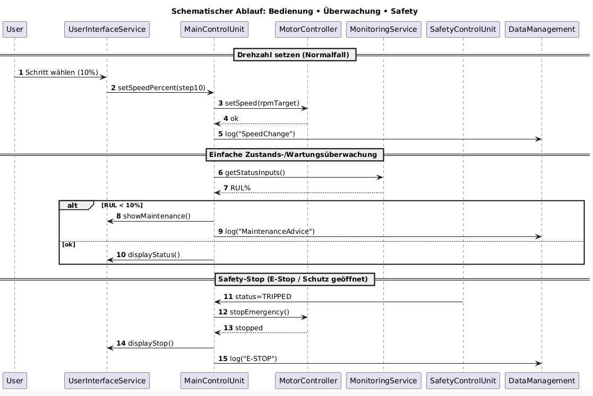

# Design – Sprint 3

## Ziel von Sprint 3 im Software-Design

Sprint 3 fokussiert sich auf die **vollständige Systemabrundung** durch
persistente Protokollierung, kontrolliertes Datenwachstum und
nachvollziehbare Betriebszustände.

Der Schwerpunkt liegt auf:
- Abschluss der funktionalen Requirements (F5)
- Erfüllung der nichtfunktionalen Logging-Anforderungen (NF5)
- Nachweisbarer Systemreife (Design ↔ Implementierung ↔ Tests konsistent)

---

## Design-Zerlegung – Erweiterungen Sprint 3

### DM – Data Management / Logging

#### C05 CSV-Protokollierung (funktional abgeschlossen)

- **Aufgabe:**  
  Zyklische und ereignisbasierte Protokollierung zentraler Systemzustände
  in eine CSV-Datei zur Analyse und Nachverfolgbarkeit.

- **Sprint-3-Erweiterungen:**  
  - vollständige Implementierung der CSV-Logik  
  - konsistentes CSV-Format (Header, Zeitstempel, Werte)  
  - definierte Schnittstelle zum Dateisystem (`FileDriver`)  

- **Inputs:**  
  - `SystemStatus`  
  - `mean_current`  

- **Outputs:**  
  - persistente CSV-Dateieinträge  

- **Timing:**  
  - zyklisch (1 Hz)  
  - optional ereignisgetriggert (z. B. Safety-Trip)  

- **Trace:** F5  

---

#### C07 Log-Rotation & Speicherbegrenzung

- **Aufgabe:**  
  Sicherstellung begrenzter Dateigrößen durch automatische
  Log-Rotation zur Einhaltung von Speicherrestriktionen.

- **Sprint-3-Designentscheidung:**  
  - maximale Dateigröße pro Logfile  
  - deterministische Rotation (z. B. indexierte Dateien)  
  - kein Datenverlust während aktiver Rotation  

- **Inputs:**  
  - aktuelle Dateigröße  
  - Log-Schreibanforderung  

- **Outputs:**  
  - neue Logdatei  
  - archivierte Altdatei  

- **Timing:**  
  - prüfend vor jedem Schreibvorgang  

- **Trace:** NF5  

---

## Interaktion mit bestehender Architektur

- `MainControlUnit` liefert weiterhin aggregierten `SystemStatus`
- `MonitoringService` ergänzt Messdaten
- `CsvLogger` agiert rein passiv (keine Steuerlogik)
- keine Rückwirkung auf Regelung oder Safety-Pfade

---

## Klassendiagramm – Sprint 3 Anpassungen

Das Klassendiagramm aus Sprint 2 bleibt in Sprint 3 **strukturell unverändert**.
Die in Sprint 3 umgesetzten Logging- und Rotationsfunktionen stellen
eine funktionale Vervollständigung bestehender Klassen dar und führen
keine neuen Architekturabhängigkeiten ein.
- `CsvLogger`
  - vollständig spezifizierte Methoden
  - klare Abhängigkeit zu `FileDriver`
- `FileDriver`
  - explizite Verantwortung für Dateihandling
- UI weiterhin **Adapter**, kein direkter Trace

---

## Sequenzdiagramm – Sprint 3 Szenarien

Das Sequenzdiagramm aus Sprint 2 bleibt ebenfalls **gültig für Sprint 3**.
Die CSV-Protokollierung und Log-Rotation erfolgen als nachgelagerte,
nicht-blockierende Schritte im bestehenden Systemablauf.
- zyklischer Systemlauf mit Logeintrag
- Log-Rotation bei Grenzwertüberschreitung
- Safety-Event mit sofortigem Status-Logging

---

## Kommunikationsdiagramm

Das Kommunikationsdiagramm aus Sprint 2 bleibt in Sprint 3 **vollständig gültig**.
Die in Sprint 3 umgesetzten Erweiterungen (CSV-Protokollierung und
Log-Rotation) verändern weder die Anzahl der beteiligten Komponenten
noch deren Kommunikationsbeziehungen.

Es wurden keine neuen Kommunikationspfade eingeführt, sondern lediglich
bestehende Interaktionen funktional vervollständigt.

---

## Design-Entscheidungen Sprint 3

- **Keine Erweiterung der MCU-Verantwortung**
- **Logging strikt nachgelagert**
- **Keine Seiteneffekte auf Echtzeitpfade**
- **Traceability vollständig geschlossen**

---

## Abschlussbewertung Design-Reife

- Alle funktionalen und nichtfunktionalen Requirements modelliert
- Design entspricht Implementierungsstand
- Architektur stabil, erweiterbar und prüfbar

Sprint 3 stellt den **Design-Abschluss** des Projekts dar.
